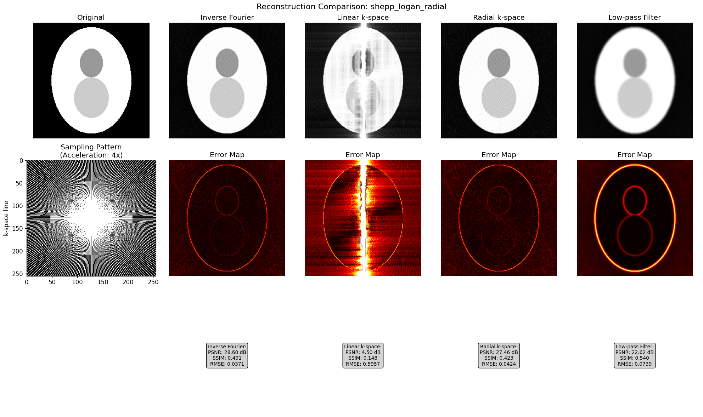
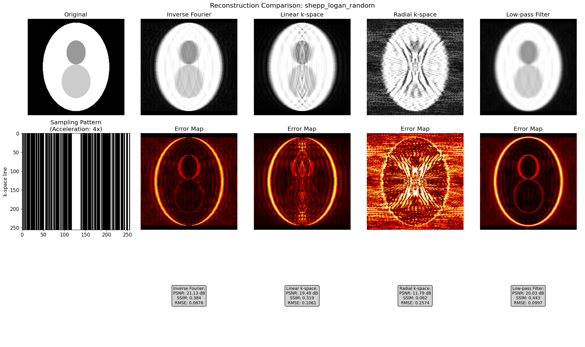

# Evaluation of Interpolation-Based MRI Reconstruction Techniques Using Linear and Radial Interpolation

## Overview

This study evaluates the performance of various interpolation-based image reconstruction methods applied to undersampled magnetic resonance imaging (MRI) data. Using synthetic phantoms and controlled sampling patterns, we assess the capacity of simple linear interpolation schemes to recover image structure and quantify the resulting image quality.

## Methodology

### 1. Phantom Generation

Two phantoms were synthetically generated:

- **Shepp-Logan Phantom**: Simulates human head cross-sections via overlapping ellipses with different intensities. A standard benchmark in tomographic reconstruction.
- **Resolution Phantom**: Horizontal bands filled with sinusoids of increasing frequency to probe spatial resolution capabilities.

All phantoms are sized \(256 \times 256\) pixels.

### 2. k-Space Undersampling

Undersampling was implemented in k-space using binary masks (True = sampled). Two sampling strategies were evaluated, each with an acceleration factor of 4:

- **Radial Sampling**: Lines (spokes) through the k-space center are retained. Mimics non-Cartesian acquisitions.
- **Random Cartesian Sampling**: Fully samples the center 8% of k-space (low-frequency content), while randomly selecting the remaining lines to meet the acceleration target.

### 3. Reconstruction Techniques

The following methods were applied to the undersampled k-space:

#### a. **Inverse Fourier (Zero-filling)**

Missing data is zero-filled. The image is reconstructed directly using inverse 2D FFT.

#### b. **Linear Interpolation (kx-direction)**

Real and imaginary parts are interpolated separately along the frequency-encoding direction (horizontal lines in k-space).

#### c. **Radial Interpolation (Linear)**

Interpolation is performed along radial spokes in k-space using **linear interpolation**. For each angle:
- Sampled complex values along the radial line are extracted.
- 1D linear interpolation is applied to fill missing samples.

#### d. **Low-Pass Filtering**

Reconstruction is performed via zero-filling, followed by Gaussian filtering in the image domain to suppress high-frequency artifacts.

---

## Results

Reconstructed images were evaluated using:

- **PSNR** (Peak Signal-to-Noise Ratio, dB)
- **SSIM** (Structural Similarity Index)
- **RMSE** (Root Mean Squared Error)

Each method was applied to the Shepp-Logan phantom using both sampling masks. The visual results and associated metrics are presented below.

### Shepp-Logan Phantom — Radial Sampling

### Shepp-Logan Phantom — Random Sampling

---

## Observations

- **Inverse Fourier (Zero-filling)** provided a surprisingly strong baseline, especially for radially sampled data. The lack of interpolation artifacts helped preserve global structure.
- **Linear Interpolation in kx** performed poorly under radial sampling due to mismatch between sampling geometry and interpolation direction. Artifacts were pronounced and anisotropic. Performes better than cubic extrapolation.
- **Linear Radial Interpolation** produced significantly cleaner reconstructions than cubic radial interpolation (from the previous experiment). Linear interpolation avoids the overshooting artifacts sometimes introduced by cubic splines, resulting in improved PSNR and lower RMSE.
- **Low-Pass Filtering** removed high-frequency noise but at the cost of strong blurring. SSIM improved modestly, but structural sharpness was lost.

---

## Quantitative Summary

| Scenario                | Method             | PSNR (dB) | SSIM   | RMSE   |
|------------------------|--------------------|-----------|--------|--------|
| shepp_logan_radial     | Inverse Fourier     | 28.60     | 0.491  | 0.0371 |
| shepp_logan_radial     | Linear k-space      | 4.50      | 0.148  | 0.5957 |
| shepp_logan_radial     | Radial k-space      | 27.46     | 0.423  | 0.0424 |
| shepp_logan_radial     | Low-pass Filter     | 22.62     | 0.540  | 0.0739 |
| shepp_logan_random     | Inverse Fourier     | 21.20     | 0.366  | 0.0871 |
| shepp_logan_random     | Linear k-space      | 19.22     | 0.306  | 0.1094 |
| shepp_logan_random     | Radial k-space      | 19.99     | 0.248  | 0.1001 |
| shepp_logan_random     | Low-pass Filter     | 19.98     | 0.417  | 0.1002 |

**Best method per scenario (by PSNR):**
- `shepp_logan_radial`: Inverse Fourier (28.60 dB), followed closely by **Linear Radial Interpolation** (27.46 dB)
- `shepp_logan_random`: Inverse Fourier (21.20 dB)

---

## Discussion

While interpolation-based reconstruction provides a basic mechanism for artifact reduction, the experiments show clear limitations:

- **Directional mismatch** between sampling and interpolation leads to artifact amplification.
- **Cubic radial interpolation**, despite being more aligned with radial sampling, suffers from edge discontinuities and underperformance when few spokes are available.
- **Zero-filling**, although naïve, often results in competitive or even superior image quality in the absence of strong prior knowledge.

These findings reinforce the notion that:

- **Interpolation alone is insufficient** and often degrades perceptual quality.

## Limitations and Future Work

- The study is based on idealized phantoms and noiseless simulation. Real MR acquisitions involve coil sensitivity maps, motion, and thermal noise.
- Future directions could include:
  - Deep learning-based reconstruction networks (e.g., U-Nets or unrolled architectures)
  - Multi-coil parallel imaging (e.g., GRAPPA, SENSE)

## Conclusion

Simple interpolation strategies are limited in their ability to recover image quality from undersampled k-space data. In all observed cases, zero-filling performed better. These findings suggest model-based methods for image reconstruction, but also the question might be asked if image reconstruction makes sense at all since the information that is in the data cannot be artificially increased. Whats is there is there.
