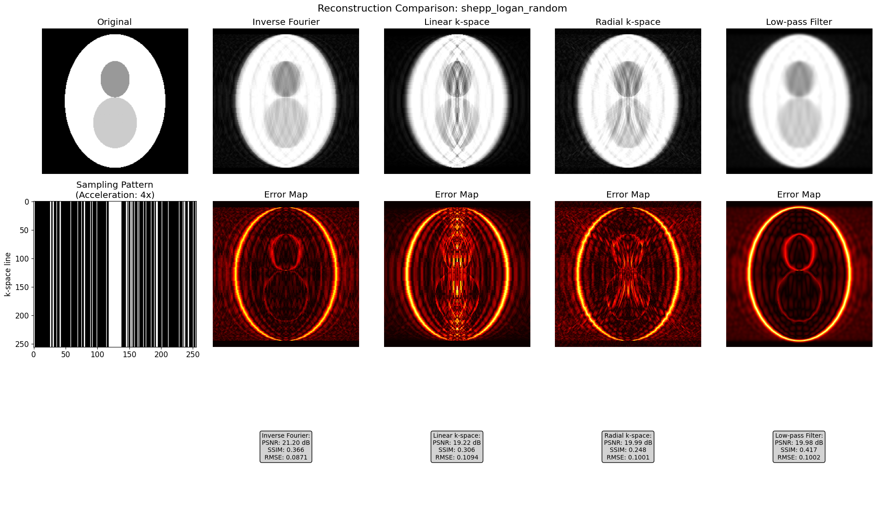

# Documentation of the script different_interpolation_methods and interpretation of the results

## Code

### Details of the code

The purpose of the code is to mimic the undersampling of MR images and investigate several reconstruction techniques. It follows these steps:
- Create Phantom (Shepp-Logan and Frequency)
- Apply fourier transformation
- Apply mask to obtain the artificial undersampled image.
- Reconstruct image (liner in x-direction, linear in radial direction, apply low pass filter).
- Backtransform and analyse

### Functions in the code

#### create_phantom():
Creates either a 'shepp-logan', consisting of several elliptic shapes of different brightness, or a 'resolution' phantom, consisting of sinusoidal waves in x-direction with frequencies [4, 8, 16, 32, 64] cycles per field of view.

#### create_undersampling_mask(shape: Tuple[int, int],pattern: str = 'random', acceleration: int = 4)
This function creates maks for the phantoms with values True or False. True means the corresponding line was sampled, and False means it was not. The two masks are:
- 'random': in the center, 8% of all lines are set to True, and of the leftover 92% of all lines 1/acceleration x=const lines are sampled.

#### to / from_kspace()
Transform to or from k-space. The k-space out/input is with DC component in the center.

#### linear_interpolation_kspace(kspace_undersampled: np.ndarray, mask: np.ndarray)
Reconstruct image using linear interpolation in k_x-direction. A line with k_y=constant is selected. Real and imaginary parts of the k-space image are lienarly interpolated seperately.

#### radial_interpolation_kspace(k_space_undersampled: np.ndarray, mask: np.ndarray)
Reconstruct image using radial interpolation in k-space. This follows these steps:
- Choose an angle, where num_angles = np.sqrt(H^2 + W^2) / 2
- Find all coordinate points on that line and append them to an array according to their line.
- Linearly inter/extrapolate data.

#### low_pass_filter_recon(kspace_undersampled: np.ndarray, mask: np.ndarray, sigma: float = 1.0)
Reconstruct image using zero-filling followed by Gaussian low-pass filtering.

## Observations

To interpret the findings, different plots were made. In the figures below, one can see the reconstructed shepp logan phantom for the masks 'radial' and 'random'. Furthermore each time, the inverse fourier reconstruction is shown for:
- No interpolation
- Linear interpolation in x-direcion
- Linear Interpolation in radial direction
- Gaussian Filter

One can see that the error map shows less error if the corresponding reconstruction method respects the symmetry of the mask. For example if the mask is linear, the error map and the RMSE / SSIM indicate that the linear construction worked better. However, in any case the reconstruction methods seem to introduce more artifacts than that they really reconstruct the image. Furthermore, the different kinds of reconstructions methods create different artifacts.

## Conclusion
The reconstruction methods that were applied did not improve the image quality. The best reconstruction was always the direct backtransformation of the undersampled image, where the overall better sampling method is radial sampling.