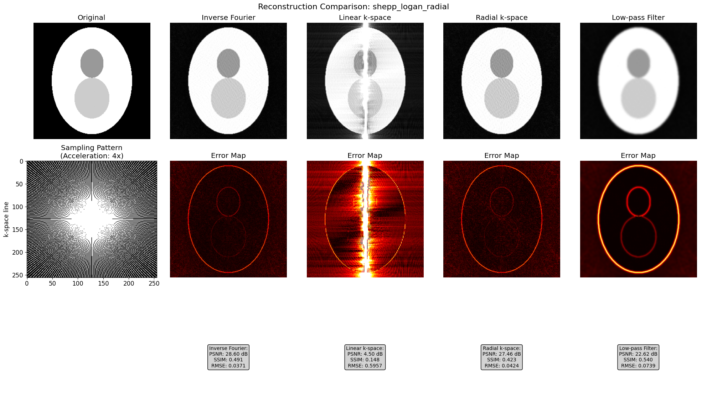

# Evaluation of Interpolation-Based MRI Reconstruction Techniques on Synthetic Phantoms

## Overview

This study investigates the effectiveness of several interpolation-based image reconstruction techniques under simulated magnetic resonance imaging (MRI) undersampling. The goal is to evaluate the degree to which simple interpolation methods can recover image quality when data is acquired with fewer samples than the Nyquist criterion requires.

## Methodology

### 1. Phantom Generation

We use two types of phantoms:

- **Shepp-Logan Phantom**: Composed of multiple ellipses of varying intensity, commonly used in tomographic reconstruction studies.
- **Resolution Phantom**: Contains horizontal sinusoidal gratings of increasing spatial frequency in five segments. This tests spatial resolution preservation across reconstruction techniques.

Both phantoms are generated at \(256 \times 256\) resolution.

### 2. k-Space Undersampling

Undersampling is performed in k-space using binary masks with an acceleration factor of 4 (i.e., 25% of the data is retained). Two sampling schemes are tested:

- **Radial**: Simulates spokes emanating from the center of k-space, mimicking radial acquisition protocols.
- **Random**: Retains a fully sampled central region (8% of frequency lines) and randomly selects remaining lines.

### 3. Reconstruction Techniques

Four reconstruction methods are applied to the undersampled k-space data:

#### a. **Inverse Fourier (Zero-filling)**

The missing data in k-space is treated as zero. An inverse 2D FFT is applied directly.

#### b. **Linear Interpolation (kx-direction)**

Missing k-space values are filled by linearly interpolating the real and imaginary parts along each kx-row (horizontal frequency axis).

#### c. **Radial Interpolation**

Missing values are estimated along radial lines passing through the center of k-space. A cubic spline is fitted to sampled values along each radial spoke and used to interpolate unsampled values.

#### d. **Low-Pass Filtering**

After zero-filling, the image is smoothed in the image domain using a Gaussian filter with \(\sigma = 2.0\).

## Results

Reconstructions are assessed using:

- **PSNR** (Peak Signal-to-Noise Ratio)
- **SSIM** (Structural Similarity Index)
- **RMSE** (Root Mean Squared Error)
- Visual inspection of reconstructions and error maps

### Shepp-Logan Phantom Reconstructions

**Sampling Pattern: Radial**

**Sampling Pattern: Random**

### Observations

- **Sampling symmetry matters**: Interpolation schemes perform best when aligned with the sampling pattern. For instance, linear interpolation along kx performs better on Cartesian/random masks, while radial interpolation suits radial masks.
- **Artifacts dominate**: All interpolation-based methods introduce reconstruction artifacts (e.g., streaking in radial, blurring in low-pass). These artifacts degrade SSIM more than they improve PSNR.
- **Simple zero-filling sometimes outperforms**: The inverse Fourier transform of the undersampled data (without interpolation) often produces fewer artifacts than over-smoothed or incorrectly interpolated reconstructions.
- **Low-pass filtering helps denoise but sacrifices detail**: It smooths noise but suppresses high-frequency features.

## Quantitative Summary

Below is a summary of the reconstruction metrics:

| Scenario                | Method             | PSNR (dB) | SSIM   | RMSE   |
|------------------------|--------------------|-----------|--------|--------|
| shepp_logan_radial     | Inverse Fourier     | 28.60     | 0.491  | 0.0371 |
| shepp_logan_radial     | Linear k-space      | 4.50      | 0.148  | 0.5957 |
| shepp_logan_radial     | Radial k-space      | 21.35     | 0.230  | 0.0856 |
| shepp_logan_radial     | Low-pass Filter     | 22.62     | 0.540  | 0.0739 |
| shepp_logan_random     | Inverse Fourier     | 21.13     | 0.384  | 0.0878 |
| shepp_logan_random     | Linear k-space      | 19.49     | 0.319  | 0.1061 |
| shepp_logan_random     | Radial k-space      | 11.79     | 0.062  | 0.2574 |
| shepp_logan_random     | Low-pass Filter     | 20.03     | 0.443  | 0.0997 |

*Best method per scenario (based on PSNR):*
- `shepp_logan_radial`: Inverse Fourier
- `shepp_logan_random`: Inverse Fourier

## Discussion

While interpolation-based reconstruction provides a basic mechanism for artifact reduction, the experiments show clear limitations:

- **Directional mismatch** between sampling and interpolation leads to artifact amplification.
- **Cubic radial interpolation**, despite being more aligned with radial sampling, suffers from edge discontinuities and underperformance when few spokes are available.
- **Zero-filling**, although naïve, often results in competitive or even superior image quality in the absence of strong prior knowledge.

These findings reinforce the notion that:

- **Data-consistent methods** (e.g., compressed sensing, model-based iterative reconstruction) are necessary for robust recovery under strong undersampling.
- **Interpolation alone is insufficient** and often degrades perceptual quality.

## Limitations and Future Work

- The study is based on idealized phantoms and noiseless simulation. Real MR acquisitions involve coil sensitivity maps, motion, and thermal noise.
- Future directions could include:
  - Deep learning-based reconstruction networks (e.g., U-Nets or unrolled architectures)
  - Multi-coil parallel imaging (e.g., GRAPPA, SENSE)

## Conclusion

Simple interpolation strategies are limited in their ability to recover image quality from undersampled k-space data. In all observed cases, zero-filling performed better. These findings suggest model-based methods for image reconstruction, but also the question might be asked if image reconstruction makes sense at all since the information that is in the data cannot be artificially increased. Whats is there is there.
