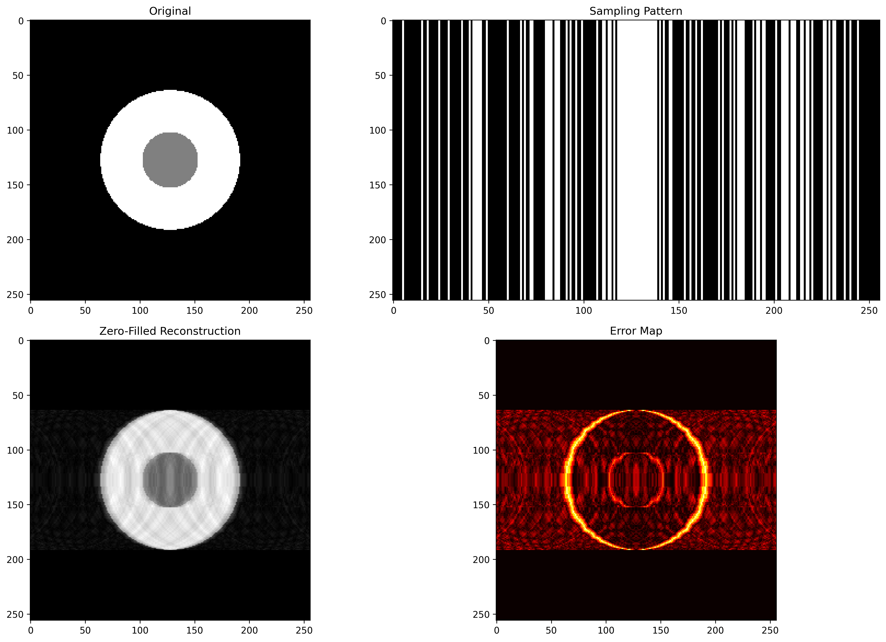

# First Reconstruction: Introduction to MRI Undersampling

A foundational script demonstrating the basic principles of MRI reconstruction from undersampled k-space data using a simple Shepp-Logan phantom.

## Concept

This implementation illustrates the fundamental challenge in accelerated MRI: when k-space lines are randomly omitted to speed up acquisition, the resulting zero-filled reconstruction suffers from characteristic artifacts. The script creates a controlled environment to observe these effects using synthetic data.

## Approach

The workflow follows the basic MRI reconstruction pipeline:
1. **Phantom Creation**: Simple two-circle Shepp-Logan phantom as ground truth
2. **k-space Transformation**: Convert image to frequency domain via 2D FFT
3. **Undersampling Simulation**: Remove random k-space lines while preserving central region (mimicking clinical protocols)
4. **Zero-filled Reconstruction**: Direct inverse FFT without gap-filling

## Key Observations

The visualization reveals fundamental undersampling artifacts:

**Sampling Pattern**: The mask shows random line sampling with a densely sampled center region, reflecting clinical MRI protocols where low frequencies (center) are crucial for image contrast.

**Artifact Characteristics**: 
- **Streaking artifacts**: Horizontal striping patterns across the entire image due to missing k-space lines
- **Noise amplification**: Background regions show increased noise compared to the original
- **Structure preservation**: Despite artifacts, the main phantom geometry remains recognizable

**Error Distribution**: The error map highlights that artifacts are distributed throughout the image, not localized to specific regions. This global nature of undersampling artifacts motivates the need for sophisticated reconstruction algorithms.

## Clinical Relevance

This simple example demonstrates why direct zero-filling is insufficient for clinical MRI acceleration. The pronounced streaking artifacts would obscure diagnostic features in real images, necessitating advanced reconstruction methods like parallel imaging, compressed sensing, or deep learning approaches explored elsewhere in this repository.

The preserved central k-space region ensures that basic image contrast is maintained, illustrating why clinical protocols always fully sample the k-space center even under aggressive acceleration.