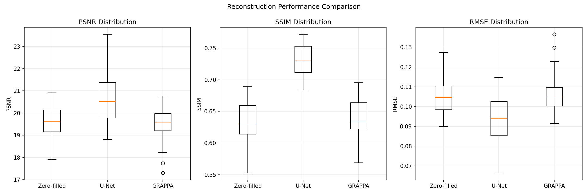
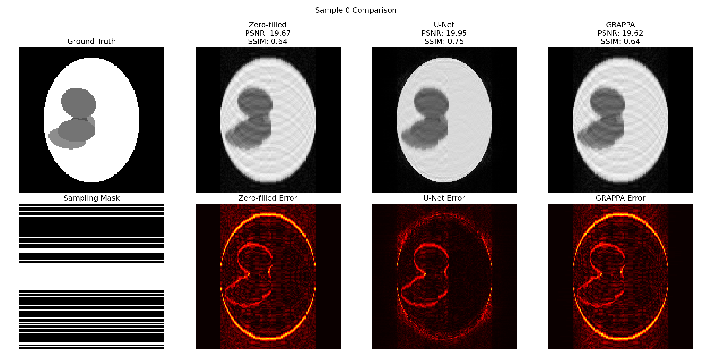
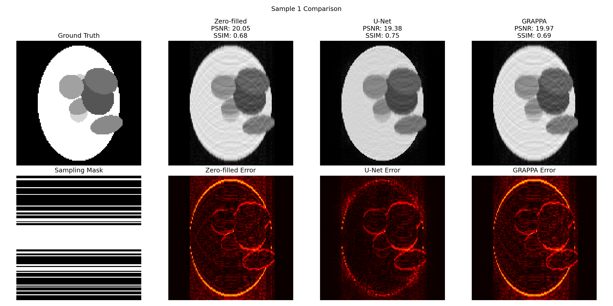
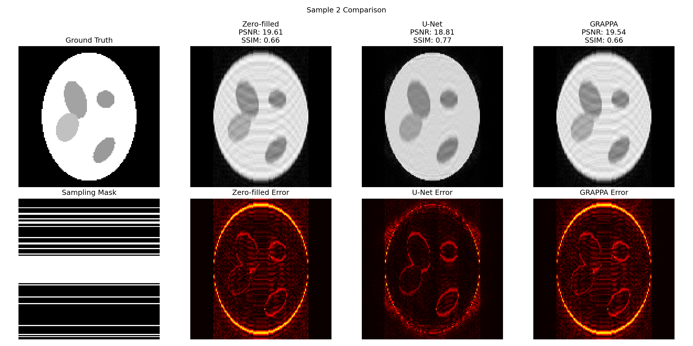

# Deep Learning for MRI Reconstruction: U-Net with Synthetic Phantom Data

This project implements a deep learning approach to accelerated MRI reconstruction using a custom U-Net architecture trained on synthetic phantom data. The work demonstrates how convolutional neural networks can effectively reconstruct high-quality images from undersampled k-space data.

## Overview

### Problem Statement
MRI scanning is inherently slow due to the sequential nature of k-space data acquisition. Accelerating MRI by undersampling k-space data introduces artifacts in the reconstructed images. This project uses deep learning to reconstruct artifact-free images from undersampled k-space measurements.

### Approach
1. **Synthetic Data Generation**: Create realistic MRI phantom data with controlled undersampling patterns
2. **Deep Learning Reconstruction**: Train an adaptive U-Net to predict missing k-space information
3. **Data Consistency**: Enforce consistency between predicted and measured k-space data

## Code Structure

### 1. Data Generation (`data_generation.py`)

This script creates synthetic MRI training data using modified Shepp-Logan phantoms:

**Key Components:**
- **`create_random_shepp_logan()`**: Generates randomized phantoms with variable ellipses, positions, and intensities
- **`create_undersampling_mask_with_acs()`**: Creates realistic undersampling patterns with:
  - Central ACS (Auto-Calibration Signal) region for calibration
  - Random undersampling at specified acceleration factors (R=4)
  - Mimics clinical parallel imaging protocols
- **k-space simulation**: Converts phantoms to k-space using 2D FFT, applies undersampling masks

**Dataset Features:**
- 400 training samples, 40 test samples
- 128×128 resolution phantoms
- 4× acceleration factor
- Realistic undersampling patterns with 24 ACS lines

### 2. Model Training (`train_unet.py`)

Implements an adaptive U-Net architecture specifically designed for MRI reconstruction:

**Architecture Innovations:**
- **Adaptive kernel sizes**: Larger kernels (7×7) for main convolutions to capture wider spatial relationships affected by undersampling
- **Built-in data consistency**: Replaces predicted k-space values with measured values where available
- **Acceleration-aware design**: Kernel sizes adapt based on acceleration factor (R=4 → 7×7 kernels)

**Training Framework:**
- PyTorch Lightning for robust training infrastructure
- Mixed precision training for GPU efficiency
- Learning rate scheduling with ReduceLROnPlateau
- Early stopping and model checkpointing
- Weights & Biases integration for experiment tracking

**Loss Function:**
- MSE loss in k-space domain
- Direct supervision on complex-valued k-space data (real/imaginary channels)

### 3. Comparative Evaluation (`compare_methods.py`)

This script implements a comprehensive comparison framework to evaluate reconstruction quality across multiple methods:

**Implemented Methods:**
1. **Zero-filled Reconstruction**: Basic inverse FFT of undersampled k-space (baseline)
2. **U-Net Reconstruction**: Deep learning approach using the trained adaptive U-Net
3. **GRAPPA Reconstruction**: Classical parallel imaging method adapted for single-coil data

**GRAPPA Implementation:**
- **Auto-calibration**: Uses ACS (Auto-Calibrating Signal) lines to learn k-space interpolation weights
- **Linear interpolation**: Predicts missing k-space points as linear combinations of neighboring acquired points
- **Least squares calibration**: Learns optimal weights from fully sampled calibration data using overdetermined system
```python
# GRAPPA learns weights w such that: missing_point = w₁×neighbor₁ + w₂×neighbor₂ + ...
weights = np.linalg.lstsq(sources_combined, targets, rcond=None)[0]
```
**Evaluation Metrics:**
- **PSNR (Peak Signal-to-Noise Ratio)**: Measures reconstruction fidelity
- **SSIM (Structural Similarity Index)**: Assesses perceptual image quality
- **RMSE (Root Mean Square Error)**: Quantifies pixel-wise reconstruction error

## Results and Observations

### Quantitative Performance Comparison

Based on evaluation across 20 test samples, the following performance metrics were obtained:



### Qualitative Analysis







The comparative visualizations reveal several key insights across different phantom configurations:

#### U-Net Strengths:
1. **Superior artifact removal**: Consistently eliminates undersampling streaks and aliasing artifacts
2. **Enhanced structural similarity**: Achieves highest SSIM scores (0.73 vs 0.64 for baseline)
3. **Robust performance**: Shows consistent improvement across diverse phantom geometries
4. **Smooth reconstructions**: Produces visually pleasing images with reduced noise

#### GRAPPA Characteristics:
1. **Classical approach limitations**: Single-coil GRAPPA shows minimal improvement over zero-filled
2. **Calibration sensitivity**: Performance depends heavily on ACS region quality and extent
3. **Linear interpolation constraints**: Limited by linear assumption in k-space relationships
4. **Computational efficiency**: Faster reconstruction compared to deep learning approach

#### Error Pattern Analysis:
From the error maps (shown in red/yellow heatmaps), several patterns emerge:

1. **Zero-filled errors**: Widespread streaking artifacts throughout the image, particularly severe at phantom boundaries
2. **U-Net errors**: Concentrated primarily at tissue boundaries with significantly reduced overall magnitude
3. **GRAPPA errors**: Similar pattern to zero-filled but with slight reduction in artifact intensity

### Technical Insights

#### Data Consistency Integration
The model enforces data consistency by replacing predicted k-space values with measured values:
```python
pred_kspace = pred_kspace * (1 - mask_expanded) + input_kspace * mask_expanded

#### Performance Variability
- **U-Net**: Shows higher variance in performance (PSNR std: 1.47 dB) but consistently achieves better average results
- **GRAPPA**: More stable performance (PSNR std: 0.79 dB) but limited improvement potential
- **Zero-filled**: Baseline reference with moderate variance (PSNR std: 0.74 dB)

#### Clinical Relevance:
- PSNR improvements of 1+ dB represent meaningful quality enhancements for diagnostic imaging
- SSIM improvements (0.635 → 0.733) indicate better preservation of structural details crucial for clinical interpretation
- The U-Net approach demonstrates clear superiority for accelerated MRI reconstruction tasks

#### Method-Specific Observations:
1. **Deep Learning Advantage**: U-Net leverages learned priors from training data to outperform traditional linear methods
2. **GRAPPA Limitations**: Single-coil adaptation of multi-coil method reduces effectiveness; full multi-coil GRAPPA would likely perform better
3. **Phantom-Specific Performance**: Complex phantom geometries (multiple overlapping ellipses) challenge all methods but U-Net shows most robust handling

The comparative analysis demonstrates that deep learning approaches, particularly the adaptive U-Net architecture, provide substantial improvements over both simple zero-filling and classical parallel imaging methods for accelerated MRI reconstruction.