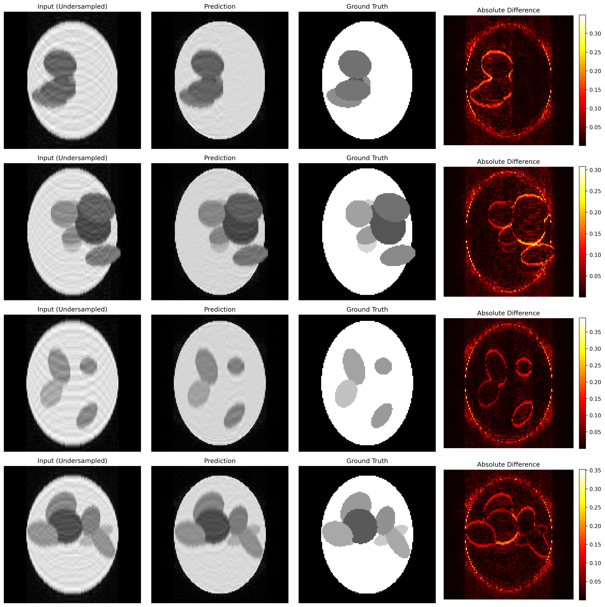

# Deep Learning for MRI Reconstruction: U-Net with Synthetic Phantom Data

This project implements a deep learning approach to accelerated MRI reconstruction using a custom U-Net architecture trained on synthetic phantom data. The work demonstrates how convolutional neural networks can effectively reconstruct high-quality images from undersampled k-space data.

## Overview

### Problem Statement
MRI scanning is inherently slow due to the sequential nature of k-space data acquisition. Accelerating MRI by undersampling k-space data introduces artifacts in the reconstructed images. This project uses deep learning to reconstruct artifact-free images from undersampled k-space measurements.

### Approach
1. **Synthetic Data Generation**: Create realistic MRI phantom data with controlled undersampling patterns
2. **Deep Learning Reconstruction**: Train an adaptive U-Net to predict missing k-space information
3. **Data Consistency**: Enforce consistency between predicted and measured k-space data

## Code Structure

### 1. Data Generation (`data_generation.py`)

This script creates synthetic MRI training data using modified Shepp-Logan phantoms:

**Key Components:**
- **`create_random_shepp_logan()`**: Generates randomized phantoms with variable ellipses, positions, and intensities
- **`create_undersampling_mask_with_acs()`**: Creates realistic undersampling patterns with:
  - Central ACS (Auto-Calibration Signal) region for calibration
  - Random undersampling at specified acceleration factors (R=4)
  - Mimics clinical parallel imaging protocols
- **k-space simulation**: Converts phantoms to k-space using 2D FFT, applies undersampling masks

**Dataset Features:**
- 400 training samples, 40 test samples
- 128×128 resolution phantoms
- 4× acceleration factor
- Realistic undersampling patterns with 24 ACS lines

### 2. Model Training (`train_unet.py`)

Implements an adaptive U-Net architecture specifically designed for MRI reconstruction:

**Architecture Innovations:**
- **Adaptive kernel sizes**: Larger kernels (7×7) for main convolutions to capture wider spatial relationships affected by undersampling
- **Built-in data consistency**: Replaces predicted k-space values with measured values where available
- **Acceleration-aware design**: Kernel sizes adapt based on acceleration factor (R=4 → 7×7 kernels)

**Training Framework:**
- PyTorch Lightning for robust training infrastructure
- Mixed precision training for GPU efficiency
- Learning rate scheduling with ReduceLROnPlateau
- Early stopping and model checkpointing
- Weights & Biases integration for experiment tracking

**Loss Function:**
- MSE loss in k-space domain
- Direct supervision on complex-valued k-space data (real/imaginary channels)

## Results and Observations

The trained model demonstrates effective reconstruction capabilities on synthetic phantom data:

### Quantitative Performance

**Average Performance**: MSE ≈ 0.00146, PSNR ≈ 28.4 dB

### Qualitative Analysis



The visualization reveals several key insights:

**Strengths:**
1. **Effective artifact removal**: The model successfully removes undersampling artifacts (aliasing streaks) visible in the zero-filled reconstructions
2. **Edge preservation**: Sharp boundaries between phantom regions are well-maintained
3. **Intensity accuracy**: Grayscale values closely match ground truth phantoms
4. **Consistent performance**: Similar quality across different phantom configurations

**Error Patterns:**
1. **Edge artifacts**: Most reconstruction errors occur at tissue boundaries (visible as red/yellow edges in difference maps)
2. **Peripheral errors**: Higher error concentration near phantom edges, suggesting boundary effect challenges
3. **Structure-dependent performance**: Complex phantom geometries (overlapping ellipses) show slightly higher reconstruction errors

**Clinical Relevance:**
- PSNR values of ~28 dB indicate good reconstruction quality for diagnostic purposes
- Low MSE values (0.001-0.002) suggest minimal overall intensity errors
- Error localization at edges is clinically acceptable as tissue boundaries are preserved

## Technical Insights

### Data Consistency Integration
The model enforces data consistency by replacing predicted k-space values with measured values:
```python
pred_kspace = pred_kspace * (1 - mask_expanded) + input_kspace * mask_expanded