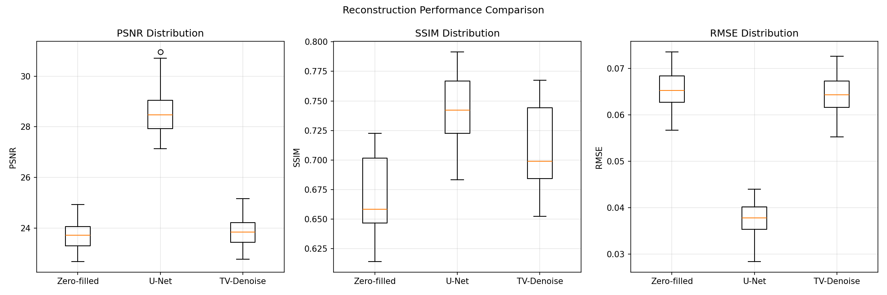
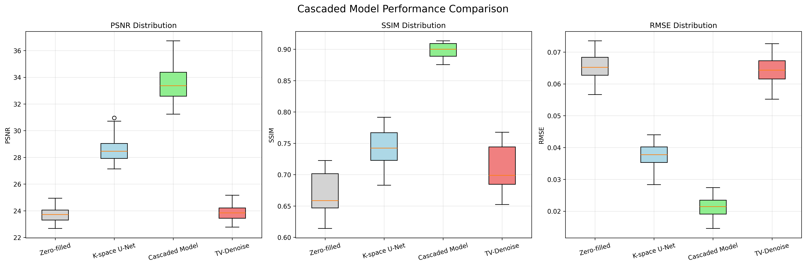
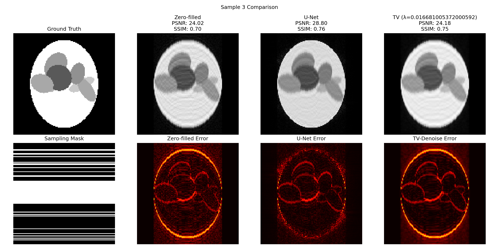
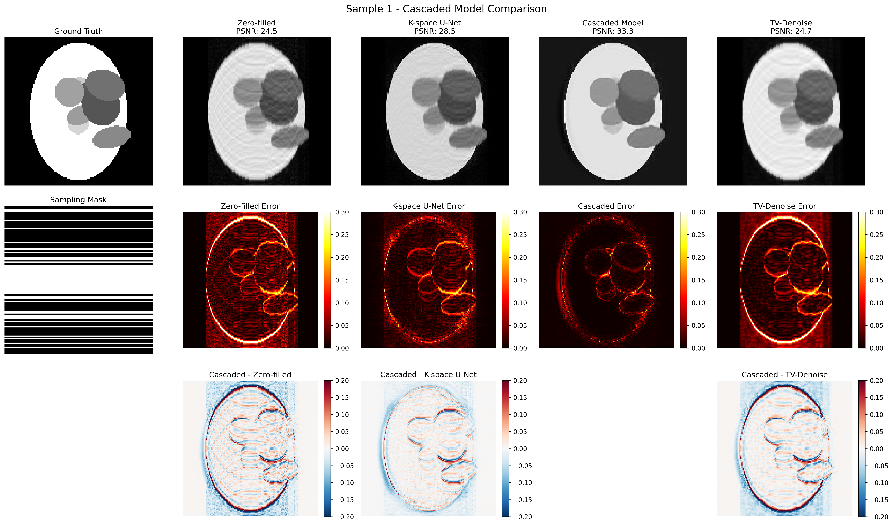

# Cascaded Deep Learning for MRI Reconstruction

**Content**: Two-stage reconstruction pipeline to recover synthetic phantom images from undersampled MRI data. After comparing a k-space U-Net against Total Variation denoising, I discovered something interesting—TV denoising could actually compete with the U-Net on SSIM metrics. This led me to develop a **cascaded approach**: first reconstruct in k-space, then refine in image space. The results speak for themselves.

---

## Overview

- **Synthetic Data**: Shepp-Logan phantoms (128×128) with R=4 undersampling and auto-calibrated center
- **Approach**: Two-stage cascade—k-space U-Net followed by image-space refinement CNN
- **Key Finding**: While TV denoising can match U-Net on SSIM (thanks to its smoothness bias), the cascaded model dominates across all metrics
- **Evaluation**: PSNR, SSIM, and RMSE computed with consistent ground-truth normalization

---

## The Journey

**Initial Setup**: I started with undersampled phantom reconstruction using a U-Net that operates in k-space with built-in data consistency. The network replaces predicted k-space values with measured ones where available.

**The Surprise**: When benchmarking against Total Variation denoising (Rudin-Osher-Fatemi model), I found that TV could occasionally match the U-Net on SSIM scores. This happens because TV's piecewise-smooth prior can boost structural similarity metrics, even while losing fine details.

**The Idea**: If TV excels at structural smoothing and U-Net excels at data-consistent reconstruction, why not combine their strengths? I designed a cascaded model:
1. **Stage 1**: K-space U-Net (frozen after training) performs data-consistent frequency domain reconstruction
2. **Stage 2**: Image-space CNN refines the magnitude image using residual learning

**The Result**: The cascaded approach achieves the highest PSNR/SSIM and lowest RMSE, with more stable performance across different phantoms.

---

## Results

### Performance Comparison: K-space Reconstruction vs TV Denoising


The U-Net clearly outperforms zero-filling on all metrics. TV denoising shows competitive SSIM due to its smoothing properties, but typically underperforms on PSNR and RMSE while removing fine structural details.

### Cascaded Model Performance


The cascaded approach delivers superior and more consistent reconstruction quality across all metrics, with tighter performance distributions indicating better stability.

---

## Sample Reconstructions

**K-space reconstruction vs TV denoising** — sample comparisons:



**Cascaded vs other methods** — showing the refinement improvements:



These visualizations include reconstruction images, error maps, and difference maps showing how the cascaded approach reduces artifacts while preserving structural details.

---

## Technical Approach

### Methods
- **Zero-filled**: Direct inverse FFT of undersampled k-space
- **TV Denoising**: Rudin-Osher-Fatemi model solving `min_u (1/2)||u-x||²₂ + λ·TV(u)` via fast dual optimization
- **K-space U-Net**: Adaptive-kernel architecture with built-in data consistency
- **Cascaded Model**: Frozen k-space U-Net → IFFT → trainable image refinement CNN with residual learning

### Evaluation Standards
All metrics use consistent ground-truth-based normalization to avoid the common pitfall of independent image normalization that inflates PSNR/SSIM for overly smooth outputs. Results reported on 20 held-out test samples.

### Why the Cascade Works
- **K-space stage**: Leverages data consistency and frequency domain priors for artifact-free reconstruction
- **Image stage**: Applies spatial priors to remove residual aliasing and enhance edge definition
- **Combined benefit**: Maintains data fidelity while achieving superior perceptual quality without TV's over-smoothing

---

## Implementation

### Scripts
- `train_unet.py` — Train the k-space U-Net with data consistency
- `compare_methods.py` — Compare zero-filled, U-Net, and TV denoising approaches  
- `train_cascaded_refinement.py` — Train the image refinement stage with frozen k-space model
- `compare_cascased_with_tv.py` — Full cascaded evaluation vs all other methods

### Data Requirements
- `mri_dataset.h5` with train/test groups containing phantoms, full k-space, undersampled k-space, and sampling masks
- Pre-trained model weights: `adaptive-unet.pth` and `refinement_model.pth`

### Repository Structure
```
├── train_unet.py                    # Adaptive U-Net (k-space) + Lightning training
├── train_cascaded_refinement.py     # Stage-2 image refinement + Lightning training
├── compare_methods.py               # Zero-filled vs U-Net vs TV baseline study
├── compare_cascased_with_tv.py      # Cascaded vs K-space U-Net vs TV
├── utils.py                         # Shared helpers (complex↔tensor, FFTs, metrics, TV)
└── Plots/                           # Figures used in this README
```

---

## Future Directions

The next step is developing a **k-space agent**—an intelligent system that can adaptively determine optimal k-space sampling patterns and reconstruction strategies for different imaging scenarios.

---

**Technical Stack**: PyTorch Lightning, NumPy/SciPy, scikit-image, HDF5, Matplotlib